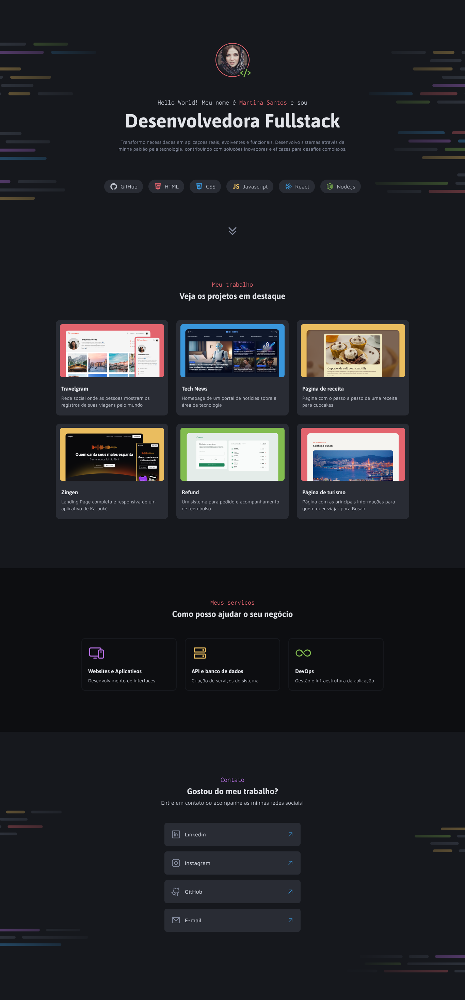

# Project Portfolio Dev

Welcome to **Project Portfolio Dev**, a desktop portfolio website designed specifically for developers to showcase their projects and provide contact information in an engaging and professional manner.



🌐 **[Live Demo](https://rodrigovaladao.github.io/project-portfolio-dev/)**

---

## 🚀 Features

- **Project Showcase:** Display your work in an organised and visually appealing way.
- **Contact Section:** Provide easy-to-access contact links for potential clients and employers.
- **Responsive Design:** Optimised for desktop viewing with a clean and modern interface.
- **User-Friendly Navigation:** Intuitive layout for effortless browsing.

---

## 🛠 Technologies Used

- **HTML5:** Structuring the content.
- **CSS3:** Styling for an elegant and responsive user interface.

---

## 📂 Project Structure

```
PROJECT-PORTFOLIO-DEV/
├── .vscode/ # VS Code configuration files
│ └── settings.json # Editor settings
│
├── assets/ # Static assets (images, icons, etc.)
│ ├── icons/ # Icon assets
│ ├── images/ # Image assets
│ └── Thumbnail.png # Project thumbnail image
│
├── styles/ # CSS stylesheets
│ ├── contact.css # Contact page styles
│ ├── global.css # Global styles
│ ├── header.css # Header styles
│ ├── index.css # Index page styles
│ ├── projects.css # Projects page styles
│ └── services.css # Services page styles
│
├── .gitignore # Git ignore file
├── index.html # Main HTML file
└── README.md # Project documentation
```

## 📞 Contact

If you would like to connect, feel free to reach out:

- 🌐 LinkedIn: [linkedin.com/in/rodrigovaladao](https://linkedin.com/in/rodrigovaladao)
